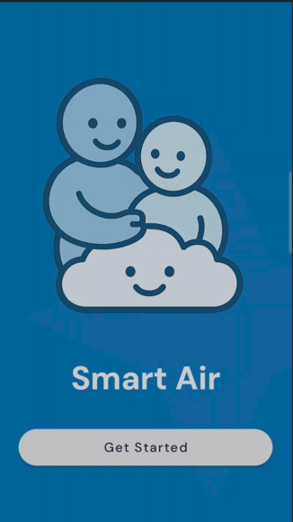
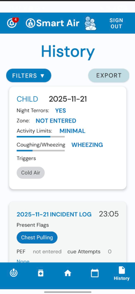
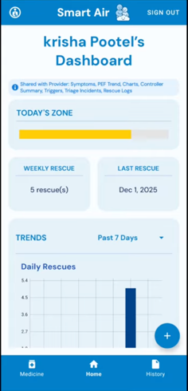

# SMART AIR ☁️

SmartAir is a kid-friendly Android application designed to help children ages **6–16** understand and manage their asthma, while giving parents the tools to track medicine use, symptoms, PEF zones, and safety alerts. Parents can selectively share their child’s data with healthcare providers through a **consise, exportable PDF/CSV report**.

This is a project for **CSCB07, FALL 2025**.

[Watch our demo here.](https://www.youtube.com/watch?v=NicjOoLmAgQ)

---

## Images 





## Features

Features are personalized based on the user role; provider, parent and child!

### Child
- Sign in through username and password
- Monitor patterns through daily check-ins 
- Log **rescue** and **controller** medications 
- Capture pre/post “Better/Same/Worse” feelings from dose
- Animated **Inhaler Technique Helper** (seal, slow breath, hold 10s, spacer tips)
- Motivation through **badges and streaks** for good technique and adherence
- Access one-tap triage guidance to manage breathing troubles
- Enter **peak-flow (PEF)** values with automatic zone calculation

---

### Parent 
- Create, link and manage multiple children by invite code
- View a dashboard of information including:
  - Today’s asthma zone
  - Last rescue time
  - Weekly rescue count
  - 7-day & 30-day trend snippets
- Track medication inventory (purchase date, expiry, remaining amount)
- Configure planned controller schedule for adherence tracking
- Set up Personal Best (PB) for PEF calculations
- Plan out zone-specific action plans 
- Get notified with real-time alerts for children:
  - Red-zone day
  - Rapid rescue repeats (≥3 uses in 3 hours)
  - “Worse after dose”
  - Inventory expired
  - low canister (≤20%) from max 300
  - Triage escalation
- Monitor each child's patterns through daily checkins and history
- Manage toggle permissions for provider information accessiblity 

---

### Provider (Read-Only)
- View children's data based on parent given permission
Parents can share data with a healthcare provider through:
- A **one-time 7-day invite code/link**
- A **PDF or CSV export**

Providers can only view the following categories with parent's permission:
- Rescue logs
- Controller adherence summary
- Symptoms
- Triggers
- Peak-flow values
- Triage incidents
- Summary graphs and charts

### Provider Report 
- Provider report contains a bar chart for zone values, and a line chart for PEF values 
- Symptom Burden Day: A day with high activity values based on daily-checkin 
- Rescue Frequency: The number of days where rescue inhaler was used / the total number of days in the period
- Notable Triage Incident: Where 3+ red flags were chosen and alarming/high rescue usage values (i.e. >= 5)
  
---


# **Project Structure**

```
/adapter
/Contracts
/fragments
/modelClasses
/Presenters
/Repository
/viewmodel
Activities + DialogFragments (e.g., MainActivity, SignInActivity)
Utilities (ExpiryCheck, FirebaseInitializer, TriageState)
```

---

# **System Architecture**

Uses an **MVP + Repository** pattern, along with MVVM for certain aspects.

```
UI Layer (Activities, Fragments)
            ↓
ViewModel Layer (State logic, transformations, validation)
            ↓
Repository Layer (Firestore)     
```

For login, the MVP model was used as per requirements.

```
UI Layer (View) 
            ↓
Presenter (Communication between View and Model)
            ↓
Repository/Model Layer (Firestore reads/writes)
```

### **Key Files** 

`AuthRepository` : Holds all Firebase calls and backend logic for authentication
 - Similarly for the other repositories as well (i.e. Child Repository, etc.)

`AuthContract` : Contract Interface between model, view and presenter 

`SignInPresenter/SignUpPresenter` : Presenters for authentication 
 
`SharedChildViewModel`: View Model to toggle between children across pages. 

`MainActivity.java` : Main activity holds all key functionality universal to all roles. Handles all view models and global listeners. 


---

# **General Firestore Schema**

```
users/
    {authUid}
        role: "parent" | "child" | "provider"

children/
    {childUid}
        name, age, etc.
        inventory/
        rescueLog/
        controllerLog/

actionPlan/
    {childUid}

incidentLog/
    {childUid}/{sessionEntryID}

dailyCheckins/
    {childUid}/{yyyy-MM-dd}

invites/
    {inviteCode}

notifications/
    {parentUid}/{notificationId}
```

---

# **Key Modules Explained**

### **1. Authentication**

* Stores role and user details under `users/{authUid}`.
* Role determines post-login navigation.

### **2. Child Management**

* Each child has their own Firestore node under `children/{childUid}`.
* Children contain three subcollections:
    * `inventory/`
    * `controllerLog/`
    * `rescueLog/`
* Providers and parents link via invite codes.

### **3. Logging Module**

* Rescue logs update the rescue badge count.
* Controller logs support long-term adherence tracking.
* Incident logs store session summaries.

### **4. Daily Check-ins**

Stored under:
`dailyCheckins/{childUid}/{yyyy-MM-dd}`
One entry per day.

### **5. Inventory Management**

* Tracks dose count and expiry date.
* The first time a device opens "Inventory," a **local** expiry notification is registered.

---

# **Component Interaction Flow**

### **App Launch**

1. **LandingPageActivity** → choose Sign In or Sign Up
3. Role determines what pages are accessible. 

### **Selecting a Child**

* Shared ViewModel stores `activeChildUid`.

---

# **Design Assumptions**

* Reports are always generated based on **the child selected on the dashboard**.
* Rescue badge count updates automatically on rescueLog writes.
* Invite codes uniquely connect parents ↔ children or parents ↔ providers.
* Daily check-ins are uniquely identified by the date string.

---

# **Getting Started**

### **Requirements**

* Android Studio
* Firebase project with Authentication + Firestore enabled
* Java 17 / Android SDK 26+

### **Setup**

1. Clone the repository
2. Add the `google-services.json` in `/app` (app-level)
3. Build & run on device or emulator

---

## Team Members & Contributions 

### Krisha Patel (Scrum Master)
- Sign-in & Firebase Authentication, account recovery
- Role selection routing & Onboarding
- Worse dose alert, notification centre setup
- Streaks and Badges, technique Helper

### Anjali Patidar (Team Member)
- Manage children features, parent and child linking 
- Granular sharing, in-app labels on items, behaviour toggles
- Provider accessibility, invitation flow

### Faiza Khan (Team Member)
- Dashboard tiles for parent
- Shareable PDF for provider report
- Adherence

### Jennifer Huang (Team Member)
- One-tap triage session and alerts for child
- Set start at home action plan to each zone for parent
- Inventory page functionality and alerts
- Rapid rescue repeats

### Tharjiha Suthekara (Team Member)
- Daily check-in & triggers
- History browser, generate CSV/PDF for History
- Child dropdown list
- PEF, Personal Best and zone calculations
- Incident log, red-zone day alerts
- Toolbar

### Zupaash Naveed (Team Member)
- Medicine logs (rescue & controller), medication home page
- Rescue badge calculations
- Pre/Post Check
- Inventory UI
